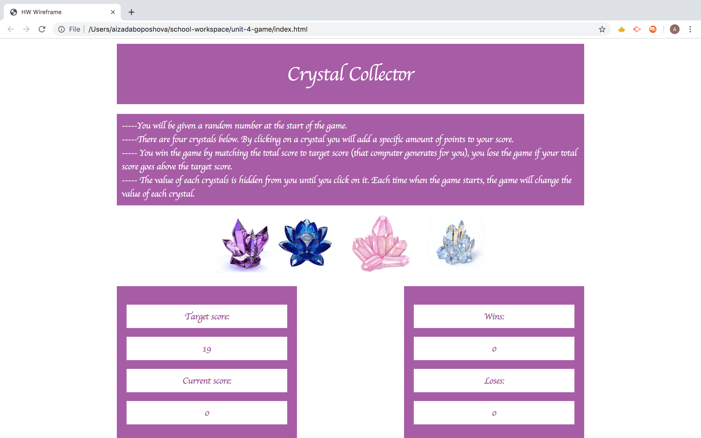

# unit-4-game
# Instruction

   * There will be four crystals displayed in the page.
   * To begin the game simply click on one of the crystal. 
   * You will be shown a random number at the start of the game, it's a target number you need to reach.
   * When you click on a crystal, it will add a specific amount of points to the player's total score. 
   * You will win if the total score matches the random number from the beginning of the game.
   * And you will lose if the score goes above the random number.
   * The game restarts whenever you win or lose.
   * Hope you enjoy the game! Have fun now!

  
    